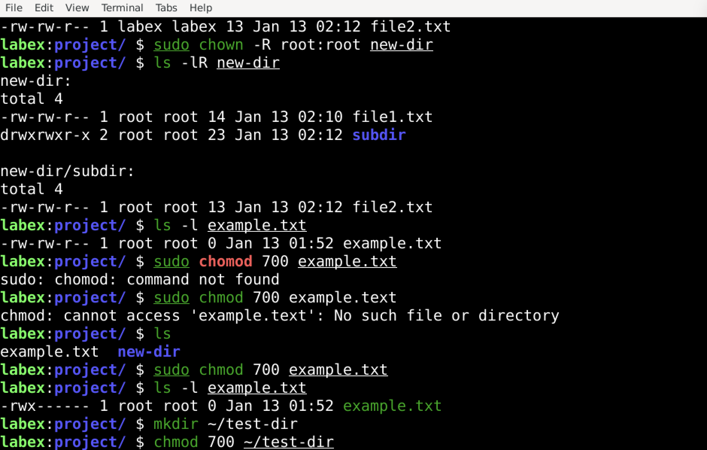
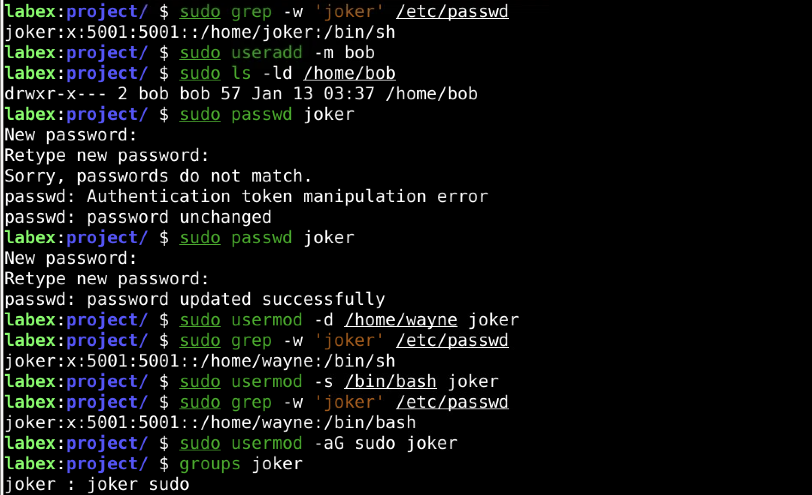

## Week 01 — Linux Basics

### What I Learned
- Learn filesystem structure
- Learn users & permissions
- Practice ls, cd, chmod, chown
- Create a new user
- Break permissions and fix them

### What I Did
- Create users
- Broke permissions intentionally
- Fixed access issues

### Evidence

### Key Takeaway
